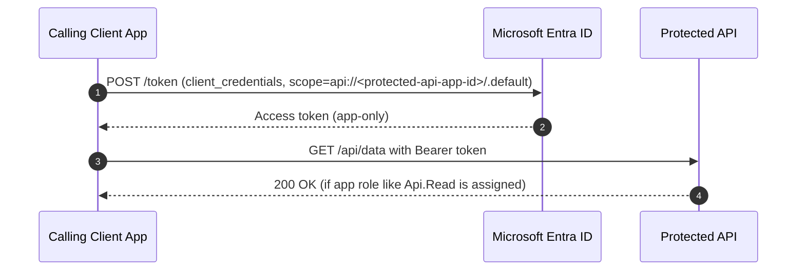
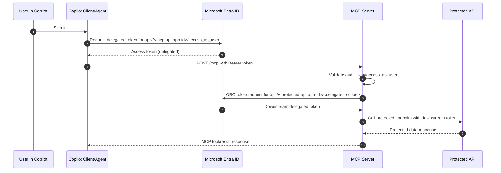

# Deploying to IIS

These instructions assume you have already received the published website files, preferably as:

OAuthClientCredsTestSite.zip

Run all commands below on the IIS server in **PowerShell opened as Administrator**.

## 1. Copy the files to the server

Copy these files to the server, for example into `C:\Deploy`:

C:\Deploy\OAuthClientCredsTestSite.zip  
C:\Deploy\deploy-iis-vm.ps1  
C:\Deploy\request-letsencrypt-certificate.ps1  

The deployment script installs/configures IIS, installs the .NET 8 Hosting Bundle only when the IIS ASP.NET Core Module is missing, creates the application pool and website, and copies the published files.

## 2. Run the deployment script

Update the hostname and run:

C:\Deploy\deploy-iis-vm.ps1 ` 
  -SourcePath "C:\Deploy\OAuthClientCredsTestSite.zip" ` 
  -SiteName "OAuthClientCredsTestSite" ` 
  -AppPoolName "OAuthClientCredsTestSitePool" ` 
  -PhysicalPath "C:\inetpub\wwwroot\OAuthClientCredsTestSite" ` 
  -Port 80 ` 
  -HostName "your-hostname.example.com"

If the site is only being tested locally, omit `-HostName`:

C:\Deploy\deploy-iis-vm.ps1 ` 
  -SourcePath "C:\Deploy\OAuthClientCredsTestSite.zip" ` 
  -PhysicalPath "C:\inetpub\wwwroot\OAuthClientCredsTestSite" ` 
  -Port 80

When updating an existing site, it adds the requested HTTP binding only if it is missing and preserves all existing HTTPS bindings and certificate configuration. To redeploy without adding or changing any HTTP binding, use:

C:\Deploy\deploy-iis-vm.ps1 ` 
  -SourcePath "C:\Deploy\OAuthClientCredsTestSite.zip" ` 
  -SkipHttpBinding

`-SkipHttpBinding` is for an existing IIS site. A new site needs an initial binding. The script automatically skips the .NET 8 Hosting Bundle download when `IIS AspNetCore Module V2\aspnetcorev2.dll` is already installed.

## 3. Configure the API during deployment

When `jwtsettings.json` is not already configured, the deployment script prompts for:

- The Entra tenant ID
- The **Protected API app registration's Client ID** (not the calling client app's Client ID)

Example prompts:

Enter the Entra tenant ID: <tenant-guid>  
Enter the Protected API app registration Client ID: <protected-api-client-guid>

The script writes the values to:

C:\inetpub\wwwroot\OAuthClientCredsTestSite\jwtsettings.json

On later deployments, the existing JWT settings are preserved unless new `-TenantId` or `-ProtectedApiClientId` values are supplied. The API does not expose a runtime setup page and does not require the IIS app pool to write configuration files.

## 4. Prepare for HTTPS

The application redirects HTTP requests to HTTPS in production. Before requesting the certificate:

- Point the DNS name to the IIS server.
- Allow inbound TCP ports `80` and `443` through the server firewall.
- Confirm that the site has an HTTP binding for the DNS name.

The Let’s Encrypt script below requests the certificate and creates the HTTPS IIS binding automatically.

## 5. Create the Let's Encrypt certificate

The repository includes `scripts\request-letsencrypt-certificate.ps1`. This script uses win-acme to request a certificate, install it in IIS, and create the HTTPS binding.

Before running it:

- Install win-acme on the server at `C:\Tools\win-acme`, or provide a different path with `-WacsExe`.
- Make sure the DNS name points to the IIS server.
- Make sure inbound TCP port `80` is allowed through the firewall. Let's Encrypt uses the HTTP binding to validate domain ownership.
- Run PowerShell as Administrator.

Run the script using the deployed site and DNS name:

C:\Deploy\request-letsencrypt-certificate.ps1 ` 
  -SiteName "OAuthClientCredsTestSite" ` 
  -DnsName "example.contoso.xyz" ` 
  -EmailAddress "admin@example.com" ` 
  -WacsExe "C:\Tools\win-acme\wacs.exe"

The script first verifies that the IIS site exists and adds the HTTP host-header binding if needed. win-acme then requests and installs the certificate. After it completes, confirm that IIS has an HTTPS binding for the site:

Import-Module WebAdministration  
Get-WebBinding -Name "OAuthClientCredsTestSite"

Open the site using HTTPS:

https://<protected-api-hostname>/ 

## 6. Call the protected API

This deployment exposes a public status page at `/`, but it does not request or store client credentials. The API endpoints remain protected.

The repository includes `scripts\call-protected-api.ps1` for a direct test call. Edit the configuration values at the top of that script with the calling client app's tenant ID, client ID, client secret, protected API scope, and API URL. Do not commit a real client secret.

Run it with:

C:\Deploy\call-protected-api.ps1

Your client application must:

1. Request a client-credentials token from Microsoft Entra ID using the protected API scope:

   api://YOUR_PROTECTED_API_CLIENT_ID/.default

2. Have the protected API's `Api.Read` application permission assigned and consented.
3. Call the API with the token:

   GET <protected-api-base-url>/api/data  
   Authorization: Bearer YOUR_ACCESS_TOKEN

A valid token returns HTTP `200 OK` with a joke secret-recipe payload:

{
  "message": "Read allowed.",
  "source": "Krusty Krab secret recipe (definitely official)",
  "secretRecipe": {
    "ingredients": [
      "1 perfectly ordinary burger patty",
      "A pinch of nautical nonsense",
      "Two slices of confidence",
      "One classified mystery ingredient"
    ],
    "instructions": "Assemble with care, keep the formula secret, and serve with a wink."
  }
}

A missing or invalid token returns `401 Unauthorized`. A valid token without the required `Api.Read` role returns `403 Forbidden`.

## API endpoints

All `GET /api/data/*` endpoints require the `Api.Read` application role. The `POST /api/data` endpoint requires `Api.Write`.

| Method | Endpoint | Purpose |
| --- | --- | --- |
| GET | `/api/data` | Employee directory and demo recipe payload |
| GET | `/api/data/employees` | Employee directory |
| GET | `/api/data/competitors` | Competitor directory |
| GET | `/api/data/recipes` | Recipe archive |
| GET | `/api/data/recipies` | Backward-compatible spelling alias for recipes |
| GET | `/api/data/inventory` | Inventory quantities and reorder status |
| GET | `/api/data/sales/daily` | Daily sales summary |
| GET | `/api/data/customers` | Fictional customer loyalty data |
| GET | `/api/data/locations` | Restaurant locations and operating status |
| GET | `/api/data/reviews` | Fictional customer reviews and ratings |
| GET | `/api/data/inspections` | Food-safety inspection results |
| GET | `/api/data/employee-of-the-month` | Current employee award details |
| GET | `/api/data/secret-formula/status` | Classified formula status without recipe details |
| GET | `/api/data/underwater-weather` | Fictional underwater conditions |
| GET | `/api/data/health/ingredients` | Ingredient freshness and temperature checks |
| POST | `/api/data` | Protected write-operation test endpoint |

The splash page lists the protected endpoints without making authenticated requests. Set `Api:DisplayName` in `appsettings.json` to customize the name shown on the splash page:

{
  "Api": {
    "DisplayName": "My Protected Token API"
  }
}

The endpoint data is fictional demonstration data. Do not use the sample salary, address, phone, or customer information as real records.

## 7. Distribution package for consumers

This repository supports distributing pre-published application artifacts instead of requiring consumers to build from source.

Provide both published folders from:

C:\temp\publish\OAuthClientCredsTestSite  
C:\temp\publish\OUathMCPServer  

Recommended package layout:

TokenTesterDeployment\
  OAuthClientCredsTestSite\   # published web app output
  OUathMCPServer\             # published MCP server output
  deploy-iis-vm.ps1
  deploy-mcp-iis-vm.ps1
  request-letsencrypt-certificate.ps1

Consumers can deploy the published outputs directly to IIS without running `dotnet build`.

## 8. Placeholder conventions

Use placeholders in all setup instructions so consumers can map values to their own environment:

- `<mcp-server-base-url>`: MCP host base URL, for example `https://mcp.example.com`
- `<protected-api-base-url>`: protected API host base URL, for example `https://api.example.com`
- `<tenant-id>`: Microsoft Entra tenant GUID
- `<mcp-api-app-id>`: MCP server API app registration GUID
- `<protected-api-app-id>`: downstream protected API app registration GUID
- `<copilot-client-app-id>`: Copilot connector client app registration GUID

### 9. Copilot client setup (OAuth)

Use manual OAuth configuration for the MCP server integration.

- Server URL: `<mcp-server-base-url>/mcp`
- OAuth mode: Manual
- Authorization URL: `https://login.microsoftonline.com/<tenant-id>/oauth2/v2.0/authorize`
- Token URL: `https://login.microsoftonline.com/<tenant-id>/oauth2/v2.0/token`
- Refresh Token URL: `https://login.microsoftonline.com/<tenant-id>/oauth2/v2.0/token`
- Scope: `api://<mcp-api-app-id>/access_as_user openid profile offline_access`

Client app requirements:

1. Use the Copilot connector client app registration client ID.
2. Use a valid client secret **value** from that same app registration.
3. Add the exact redirect URI used by Copilot/APIM (for example `https://global.consent.azure-apim.net/redirect/...`).
4. Grant delegated permission to MCP scope `access_as_user`.
5. Grant admin consent.

## 10. MCP connector setup

For custom connector or MCP client testing, ensure the MCP host exposes:

- `GET /.well-known/mcp`
- `POST /mcp`
- `GET /.well-known/oauth-protected-resource`
- `GET /.well-known/oauth-protected-resource/mcp`
- `GET /.well-known/oauth-authorization-server`
- `GET /.well-known/oauth-authorization-server/mcp`
- `GET /.well-known/openid-configuration`
- `GET /.well-known/openid-configuration/mcp`

### Validation checks

Invoke-RestMethod <mcp-server-base-url>/.well-known/mcp  
Invoke-RestMethod -Method Post <mcp-server-base-url>/mcp -ContentType "application/json" -Body '{"jsonrpc":"2.0","id":1,"method":"initialize","params":{}}'  
Invoke-RestMethod -Method Post <mcp-server-base-url>/mcp -ContentType "application/json" -Body '{"jsonrpc":"2.0","id":2,"method":"tools/list","params":{}}'

## 11. Protected API role configuration

The protected API authorizes by endpoint role/scope mapping. Ensure users/groups are assigned the required app roles in the protected API enterprise app.

Current role set used by this project:

- `Api.Read`
- `Api.Write`
- `Competitor.Reader`
- `Recipe.Reader`
- `Employee.Reader`
- `Inventory.Reader`
- `Sales.Reader`
- `Customer.Reader`
- `Location.Reader`
- `Review.Reader`
- `Inspection.Reader`
- `SecretFormula.Reader`
- `Weather.Reader`
- `IngredientHealth.Reader`

Recommended assignment model:

- Assign users/groups only the minimum required roles.
- Use endpoint-specific roles (for example only `Recipe.Reader`) unless broad access is intended.

### Screenshots for this section

Use this screen to verify the MCP server app has delegated permissions to the protected API and that admin consent is granted.

### MCP app registration checks

In the MCP server app registration:

- `Expose an API`:
  - Application ID URI is set (example: `api://<mcp-api-app-id>`)
  - Scope exists: `access_as_user`
- `Authorized client applications`:
  - Add `<copilot-client-app-id>`
  - Authorize scope `access_as_user`

### Role catalog reference

Use this screen when mapping endpoint access to protected API roles (for example `Api.Read`, `Api.Write`, `Competitor.Reader`)

## 12. MCP server scope configuration

MCP server access policy expects delegated scope in incoming access tokens.

Configure `OUathMCPServer\jwtsettings.json`:
 
{
  "Jwt": {
    "Authority": "https://login.microsoftonline.com/<tenant-id>/v2.0",
    "Audiences": [
      "api://<mcp-api-app-id>"
    ],
    "RequiredScope": "access_as_user"
  }
}

## 13. MCP OBO configuration (`OUathMCPServer/obosettings.json`)

{
  "Obo": {
    "ClientId": "<mcp-server-client-app-id>",
    "ClientSecret": "<mcp-server-client-app-secret>",
    "DownstreamApiBaseUrl": "<protected-api-base-url>",
    "DownstreamScope": "api://<protected-api-app-id>/Competitor.Read",
    "DownstreamAudience": "api://<protected-api-app-id>"
  }
}

## 14. Reset or remove deployment settings

If deployment settings need to be reset, remove generated runtime configuration files and redeploy with fresh values.

Typical reset actions:

Remove-Item "C:\inetpub\wwwroot\OAuthClientCredsTestSite\jwtsettings.json" -Force -ErrorAction SilentlyContinue  
Remove-Item "C:\inetpub\wwwroot\OUathMCPServer\jwtsettings.json" -Force -ErrorAction SilentlyContinue  
Remove-Item "C:\inetpub\wwwroot\OUathMCPServer\obosettings.json" -Force -ErrorAction SilentlyContinue  

Then redeploy and reapply configuration values.

Optional cleanup for local publish output:

Remove-Item "C:\temp\publish\OAuthClientCredsTestSite" -Recurse -Force -ErrorAction SilentlyContinue  
Remove-Item "C:\temp\publish\OUathMCPServer" -Recurse -Force -ErrorAction SilentlyContinue  

## 15. Exercise 1: Client credentials flow example (app-only)

Use this flow for daemon/service-to-service calls to the protected API.

### Token request
 
$tenantId = "<tenant-id>"
$clientId = "<calling-client-app-id>"
$clientSecret = "<calling-client-app-secret>"
$scope = "api://<protected-api-app-id>/.default"

$token = Invoke-RestMethod -Method Post `
  -Uri "https://login.microsoftonline.com/$tenantId/oauth2/v2.0/token" `
  -ContentType "application/x-www-form-urlencoded" `
  -Body @{ 
    client_id     = $clientId 
    client_secret = $clientSecret 
    scope         = $scope 
    grant_type    = "client_credentials" 
  }

$token.access_token

### API call
 
$apiUrl = "<protected-api-base-url>/api/data"
Invoke-RestMethod -Method Get -Uri $apiUrl -Headers @{ Authorization = "Bearer $($token.access_token)" }

Required permission assignment: the calling client app must be assigned protected API **application roles** (for example `Api.Read`) and admin consent must be granted.

### Flow Diagrams

To better understand the interactions between components, refer to the following flow diagrams:

#### Client Credentials Flow

## 16. Exercise 2: Delegated MCP flow example (Copilot -> MCP -> API via OBO)

Use this flow when user context must be preserved.

1. Copilot signs in the user and acquires token for MCP audience `api://<mcp-api-app-id>` with scope `access_as_user`.
2. Copilot calls MCP endpoint (`/mcp`) with that bearer token.
3. MCP validates `aud` and `scp=access_as_user`.
4. MCP performs On-Behalf-Of (OBO) to obtain downstream delegated token for protected API scopes.
5. MCP calls protected API with downstream token.

In `OUathMCPServer\obosettings.json`:
 
{
  "Obo": {
    "ClientId": "<mcp-server-client-app-id>",
    "ClientSecret": "<mcp-server-client-app-secret>",
    "DownstreamApiBaseUrl": "<protected-api-base-url>",
    "DownstreamScope": "api://<protected-api-app-id>/<delegated-scope>",
    "DownstreamAudience": "api://<protected-api-app-id>"
  }
}

### Flow Diagram

## 17. Entra app permission wiring (MCP + Protected API)

Use this section for app permission setup, and use "MCP runtime token validation" wording for runtime checks.

Use the following permission model for this solution:

1. **Copilot client app -> MCP server**
   - Add delegated permission to MCP scope: `api://<mcp-api-app-id>/access_as_user`
   - Grant admin consent.
2. **MCP server app -> Protected API**
   - Add delegated permission(s) required by downstream endpoints (example: `Competitor.Reader`, `Recipe.Reader`, `Api.Read`).
   - Grant admin consent.
3. **Copilot agent -> MCP server**
   - Ensure MCP accepts delegated scope `access_as_user` in incoming tokens.
   - In MCP app registration (`Expose an API`), scope `access_as_user` must be enabled.

### MCP app registration checks

In the MCP server app registration:

- `Expose an API`:
  - Application ID URI is set (example: `api://<mcp-api-app-id>`)
  - Scope exists: `access_as_user`
- `Authorized client applications`:
  - Add `<copilot-client-app-id>`
  - Authorize scope `access_as_user`

In `OUathMCPServer\jwtsettings.json`, ensure:
 
{
  "Jwt": {
    "Authority": "https://login.microsoftonline.com/<tenant-id>/v2.0",
    "Audiences": [
      "api://<mcp-api-app-id>"
    ],
    "RequiredScope": "access_as_user"
  }
}
